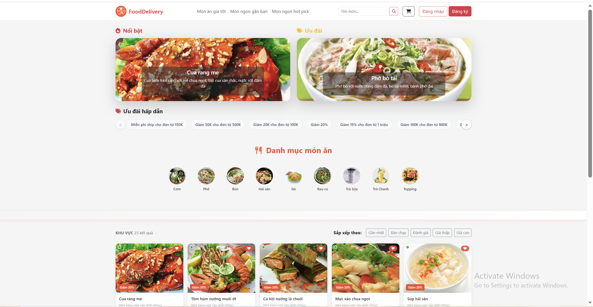

# Trưa Nay Ăn Gì — Food Ordering System

**Short description**  
Server-side rendered food ordering web application built with Spring Boot and Thymeleaf. Features user authentication, role-based access, CRUD management for restaurants/menus/orders/users, Google Maps integration for restaurant locations, and order tracking.

> Repository: https://github.com/avdt0906/trua_nay_an_gi

---

## Demo / Screenshots
<div align="center">
  <table>
    <tr>
      <td align="center">
        <br>
        <sub>Homepage</sub>
      </td>
      <td align="center">
        <br>
        <sub>Homepage / Restaurant listing</sub>
      </td>
      <td align="center">
        <br>
        <sub>Restaurant detail & menu</sub>
      </td>
    </tr>
    <tr>
      <td align="center">
        <br>
        <sub>Create order</sub>
      </td>
      <td align="center">
        <br>
        <sub>Order tracking</sub>
      </td>
      <td align="center">
        <br>
        <sub>Admin dashboard</sub>
      </td>
    </tr>
  </table>
</div>


---

## Features
- Server-side rendered UI using **Thymeleaf**.
- Authentication & authorization with **Spring Security** (role-based).
- CRUD for **Users**, **Restaurants**, **Menus**, **Orders**, etc.
- Order lifecycle and delivery assignment / order tracking.
- Google Maps integration to show restaurant locations.
- Database scripts for initial data (see `du_lieu_hinh_anh.sql`).

---

## Tech Stack
- Java + Spring Boot  
- Thymeleaf (server-side templates)  
- Spring Security  
- JPA / Hibernate  
- MySQL  
- Gradle (build system). See `build.gradle`. :contentReference[oaicite:3]{index=3}

---

## Prerequisites
- Java 11 or higher (JDK installed)
- MySQL (or compatible database)
- Git
- (Optional) IDE: IntelliJ IDEA / Eclipse
- (Optional) Google Maps API key (if you want maps in local run)

---

## Quick start — Run locally

1. **Clone repository**
```bash
git clone https://github.com/avdt0906/trua_nay_an_gi.git
